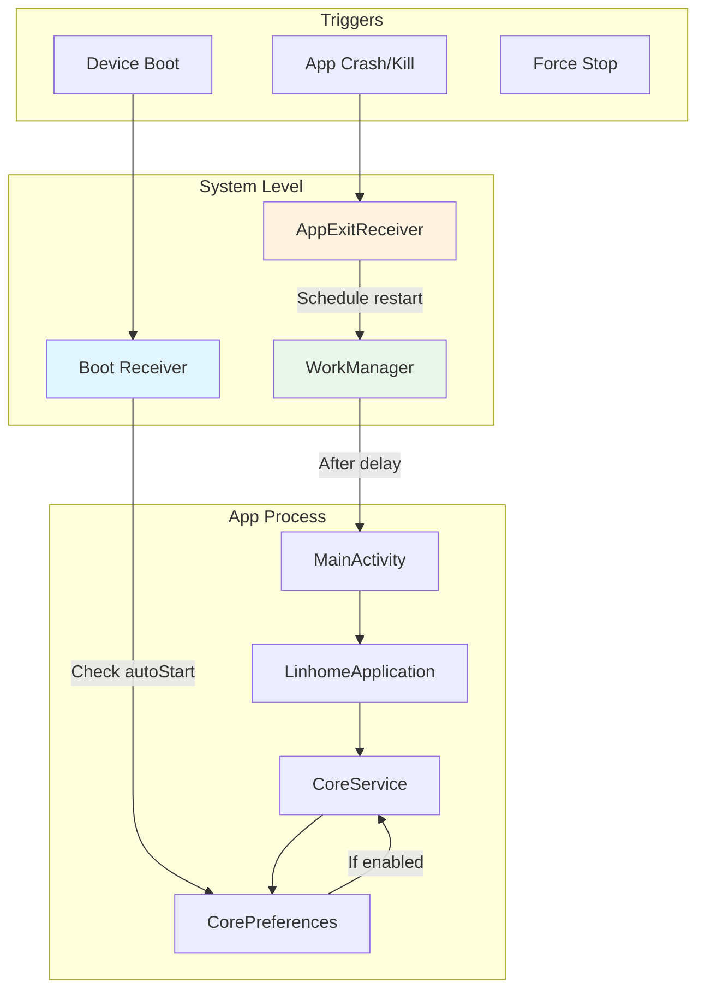

# Auto-Restart Feature Implementation Plan

## Overview
This document outlines the implementation of an auto-restart feature for the Linhome Android application that will:
1. Auto-start the app when the device boots
2. Auto-restart the app when it crashes or is killed by the system

## Current State Analysis

### Existing Infrastructure
- **BootReceiver** ([`app/src/main/java/org/linhome/linphonecore/BootReceiver.kt`](app/src/main/java/org/linhome/linphonecore/BootReceiver.kt:31)): Already handles `ACTION_BOOT_COMPLETED` and `ACTION_SHUTDOWN`
- **CoreService** ([`app/src/main/java/org/linhome/linphonecore/CoreService.kt`](app/src/main/java/org/linhome/linphonecore/CoreService.kt:30)): Foreground service that keeps the core running
- **CorePreferences** ([`app/src/main/java/org/linhome/linphonecore/CorePreferences.kt`](app/src/main/java/org/linhome/linphonecore/CorePreferences.kt:35)): Contains `autoStart` and `keepServiceAlive` preferences
- **AndroidManifest.xml** ([`app/src/main/AndroidManifest.xml`](app/src/main/AndroidManifest.xml:1)): Already has `RECEIVE_BOOT_COMPLETED` permission

### Limitations
- Android does not provide a reliable way for an app to detect its own death
- When an app is killed by the system (memory pressure, force stop), there's no callback
- The existing `keepServiceAlive` only prevents the service from being stopped, not the entire app process

## Implementation Approach

### Architecture Diagram



### Component Breakdown

#### 1. New Preference: `restartOnKill`
Add a new preference to [`CorePreferences.kt`](app/src/main/java/org/linhome/linphonecore/CorePreferences.kt:35) to allow users to enable/disable the restart-on-kill feature.

#### 2. AppExitReceiver
A `BroadcastReceiver` that schedules a restart when the app exits. Since we cannot detect app death directly, we'll use a combination of:
- `onTrimMemory()` callback to detect memory pressure
- `ActivityLifecycleCallbacks` to detect when all activities are destroyed
- WorkManager to schedule a delayed restart

#### 3. AppRestartManager
A manager class that:
- Schedules restart tasks using WorkManager
- Handles the restart logic with appropriate delays
- Prevents restart loops

#### 4. LinhomeApplication Enhancements
Add lifecycle callbacks to detect app-wide state changes.

## Implementation Steps

### Step 1: Add New Preference
Add `restartOnKill` property to [`CorePreferences.kt`](app/src/main/java/org/linhome/linphonecore/CorePreferences.kt:104):
```kotlin
var restartOnKill: Boolean
    get() = config.getBool("app", "restart_on_kill", false)
    set(value) {
        config.setBool("app", "restart_on_kill", value)
    }
```

### Step 2: Create AppExitReceiver
Create [`app/src/main/java/org/linhome/linphonecore/AppExitReceiver.kt`](app/src/main/java/org/linhome/linphonecore/AppExitReceiver.kt):
```kotlin
class AppExitReceiver : BroadcastReceiver() {
    override fun onReceive(context: Context, intent: Intent) {
        // Schedule restart using WorkManager
        val restartRequest = OneTimeWorkRequestBuilder<AppRestartWorker>()
            .setInitialDelay(5, TimeUnit.SECONDS)
            .build()
        WorkManager.getInstance(context).enqueue(restartRequest)
    }
}
```

### Step 3: Create AppRestartWorker
Create [`app/src/main/java/org/linhome/linphonecore/AppRestartWorker.kt`](app/src/main/java/org/linhome/linphonecore/AppRestartWorker.kt):
```kotlin
class AppRestartWorker(context: Context, params: WorkerParameters) : Worker(context, params) {
    override fun doWork(): Result {
        val prefs = CorePreferences(applicationContext)
        if (prefs.restartOnKill) {
            val intent = Intent(applicationContext, MainActivity::class.java)
            intent.flags = Intent.FLAG_ACTIVITY_NEW_TASK or Intent.FLAG_ACTIVITY_CLEAR_TASK
            applicationContext.startActivity(intent)
        }
        return Result.success()
    }
}
```

### Step 4: Create AppRestartManager
Create [`app/src/main/java/org/linhome/linphonecore/AppRestartManager.kt`](app/src/main/java/org/linhome/linphonecore/AppRestartManager.kt):
```kotlin
object AppRestartManager {
    private const val RESTART_ACTION = "org.linhome.action.APP_RESTART"
    
    fun scheduleRestart(context: Context) {
        val prefs = CorePreferences(context)
        if (prefs.restartOnKill) {
            val intent = Intent(context, AppExitReceiver::class.java)
            intent.action = RESTART_ACTION
            val pendingIntent = PendingIntent.getBroadcast(
                context,
                0,
                intent,
                PendingIntent.FLAG_UPDATE_CURRENT or PendingIntent.FLAG_IMMUTABLE
            )
            
            val alarmManager = context.getSystemService(Context.ALARM_SERVICE) as AlarmManager
            val triggerTime = System.currentTimeMillis() + 5000
            alarmManager.setExactAndAllowWhileIdle(
                AlarmManager.RTC_WAKEUP,
                triggerTime,
                pendingIntent
            )
        }
    }
    
    fun shouldSkipRestart(context: Context): Boolean {
        // Check if app was just restarted to avoid loops
        val prefs = context.getSharedPreferences("restart_prefs", Context.MODE_PRIVATE)
        val lastRestart = prefs.getLong("last_restart_time", 0)
        val now = System.currentTimeMillis()
        
        // Skip if restarted within last 10 seconds
        return (now - lastRestart) < 10000
    }
    
    fun markRestart(context: Context) {
        val prefs = context.getSharedPreferences("restart_prefs", Context.MODE_PRIVATE)
        prefs.edit().putLong("last_restart_time", System.currentTimeMillis()).apply()
    }
}
```

### Step 5: Update LinhomeApplication
Modify [`app/src/main/java/org/linhome/LinhomeApplication.kt`](app/src/main/java/org/linhome/LinhomeApplication.kt:37) to:
- Register ActivityLifecycleCallbacks
- Detect when app is exiting
- Schedule restart if enabled

### Step 6: Update BootReceiver
Modify [`BootReceiver.kt`](app/src/main/java/org/linhome/linphonecore/BootReceiver.kt:31) to:
- Check for restart-on-kill preference
- Use AppRestartManager for consistent restart logic

### Step 7: Add Settings UI
Add a switch widget to [`fragment_settings.xml`](app/src/main/res/layout/fragment_settings.xml:1) for the new preference.

### Step 8: Add String Resources
Add string resources to [`strings.xml`](app/src/main/res/values/strings.xml:1):
```xml
<string name="settings_restart_on_kill">Restart on app kill</string>
<string name="settings_restart_on_kill_summary">Automatically restart the app if it crashes or is killed</string>
```

### Step 9: Update AndroidManifest.xml
Add the new receiver declaration:
```xml
<receiver android:name="org.linhome.linphonecore.AppExitReceiver"
    android:exported="false" />
```

## Android Limitations and Considerations

### 1. Doze Mode and Battery Optimization
- WorkManager may be delayed during Doze mode
- Use `setExactAndAllowWhileIdle()` for critical restarts
- Users may need to whitelist the app from battery optimization

### 2. Force Stop
- If a user force-stops the app, `RECEIVE_BOOT_COMPLETED` receivers won't fire
- WorkManager jobs won't run
- This is expected Android behavior

### 3. Restart Loops
- Implement delay checks to prevent infinite restart loops
- Track last restart time in SharedPreferences

### 4. Foreground Service
- The existing `keepServiceAlive` feature helps prevent the service from being killed
- This is more reliable than app-level restart

## Testing Strategy

1. **Boot Test**: Reboot device and verify app starts automatically
2. **Kill Test**: Force stop app and verify it restarts after delay
3. **Memory Pressure Test**: Kill app via memory pressure and verify restart
4. **Preference Toggle**: Enable/disable feature and verify behavior changes
5. **Loop Prevention**: Verify restart doesn't happen infinitely

## Success Criteria

- [ ] App starts automatically on device boot when enabled
- [ ] App restarts within 10 seconds when killed (not force stopped)
- [ ] Feature can be enabled/disabled in settings
- [ ] No restart loops occur
- [ ] Works with existing `keepServiceAlive` feature
