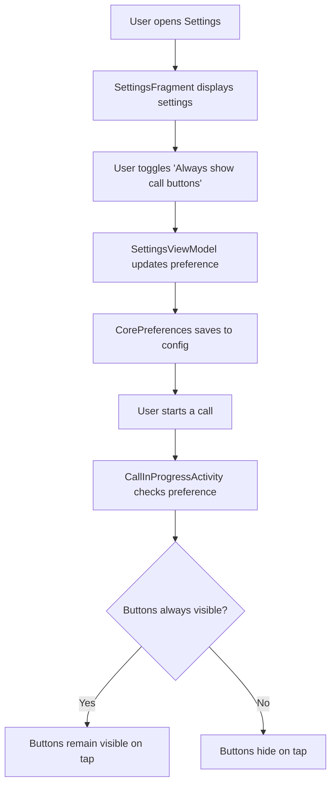
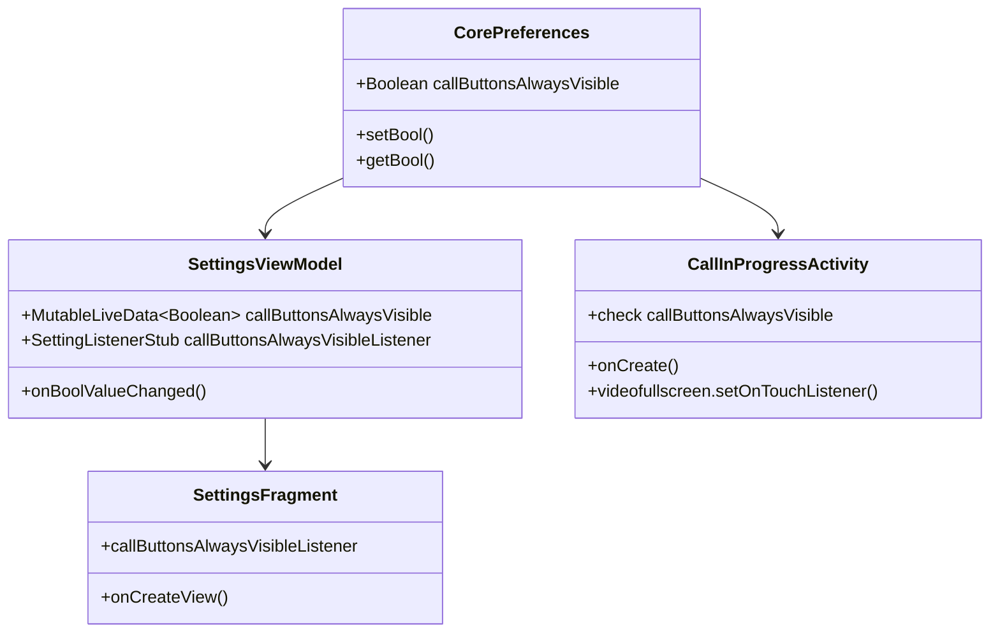

# Call Buttons Always Visible Feature

## Overview
This feature adds a setting to control whether call buttons (actions and controls) disappear when the user taps on the screen during an in-call activity. By default, buttons will stay visible.

## User Story
As a user, I want to be able to keep the call buttons visible during a call so that I can easily access them without having to tap the screen to make them appear.

## Technical Design

### Data Flow



### Component Architecture



## Implementation Steps

### 1. Add Preference to CorePreferences.kt
Add a new property to store the preference:
```kotlin
var callButtonsAlwaysVisible: Boolean
    get() = config.getBool("app", "call_buttons_always_visible", true)
    set(value) {
        config.setBool("app", "call_buttons_always_visible", value)
    }
```

### 2. Add String Resources
Add the following strings to `app/src/main/res/values/strings.xml`:
- `settings_call_buttons_always_visible` - "Always show call buttons"
- `settings_call_buttons_always_visible_summary` - "Keep call buttons visible during calls (disable tap to hide)"

### 3. Add Setting UI to fragment_settings.xml
Add a new switch widget entry after the RTSP stream settings.

### 4. Update SettingsViewModel.kt
Add:
- `MutableLiveData` for the preference value
- Listener to handle value changes
- Initialize from CorePreferences

### 5. Update CallInProgressActivity.kt
Modify the `videofullscreen.setOnTouchListener` to check the preference before hiding buttons:
```kotlin
binding.videofullscreen.setOnTouchListener { _, event ->
    if (event.action == MotionEvent.ACTION_UP) {
        val shouldHideButtons = !LinhomeApplication.corePreferences.callButtonsAlwaysVisible
        if (shouldHideButtons) {
            binding.actions.toogleVisible()
            binding.controls?.toogleVisible()
            binding.timer.toogleVisible()
        }
    }
    true
}
```

## Files to Modify

| File | Changes |
|------|---------|
| `app/src/main/java/org/linhome/linphonecore/CorePreferences.kt` | Add `callButtonsAlwaysVisible` property |
| `app/src/main/res/values/strings.xml` | Add string resources for the setting |
| `app/src/main/res/layout/fragment_settings.xml` | Add switch widget for the setting |
| `app/src/main/java/org/linhome/ui/settings/SettingsViewModel.kt` | Add LiveData and listener |
| `app/src/main/java/org/linhome/ui/call/CallInProgressActivity.kt` | Modify touch listener to check preference |

## Default Behavior
- **Default**: `true` (buttons always visible)
- **User can disable**: If set to `false`, buttons will hide on tap (original behavior)

## Testing Checklist
- [ ] Verify setting appears in Settings screen
- [ ] Verify toggle works correctly
- [ ] Verify preference is saved and persists across app restarts
- [ ] Verify buttons stay visible when setting is enabled
- [ ] Verify buttons hide when setting is disabled
- [ ] Verify video fullscreen toggle still works correctly
