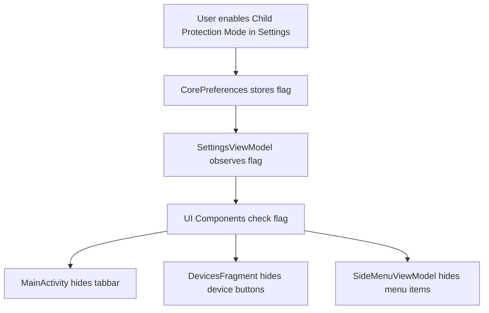
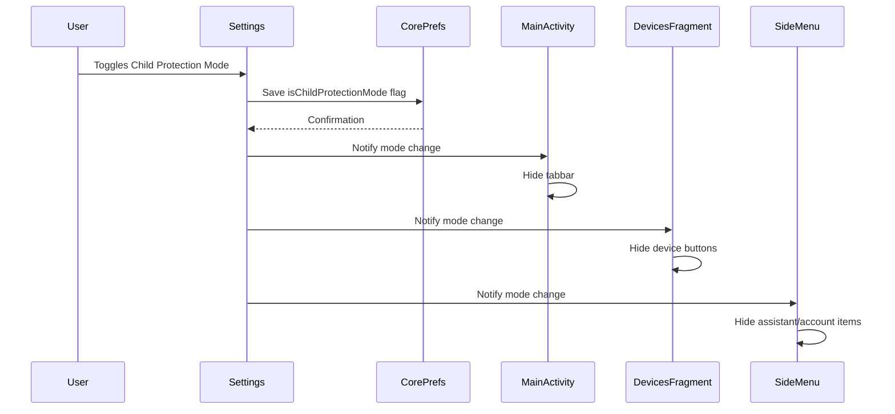

# Child Protection Mode Implementation Plan

## Overview
This plan outlines the implementation of a child protection mode feature that:
1. Hides the tabbar from the main activity
2. Hides device addition and device editing buttons
3. Hides "account assistant" and "my account" from the settings/side menu

## Architecture

### Data Flow


### Component Interactions


## Implementation Details

### 1. CorePreferences.kt
Add a new preference to store the child protection mode state:
```kotlin
var childProtectionMode: Boolean
    get() = config.getBool("app", "child_protection_mode", false)
    set(value) {
        config.setBool("app", "child_protection_mode", value)
    }
```

### 2. strings.xml
Add string resources for the child protection mode UI:
```xml
<string name="settings_child_protection_mode">Child Protection Mode</string>
<string name="settings_child_protection_mode_summary">Hide device management and account features</string>
```

### 3. SettingsViewModel.kt
Add a MutableLiveData for the child protection mode state:
```kotlin
val childProtectionMode = MutableLiveData(corePref.childProtectionMode)

val childProtectionModeListener = object : SettingListenerStub() {
    override fun onBoolValueChanged(newValue: Boolean) {
        corePref.childProtectionMode = newValue
    }
}
```

### 4. fragment_settings.xml
Add the child protection mode toggle UI:
```xml
<include
    layout="@layout/settings_widget_switch"
    title='@{model.getText("settings_child_protection_mode")}'
    subtitle="@{model.getText(\"settings_child_protection_mode_summary\")}"
    listener="@{model.childProtectionModeListener}"
    checked="@={model.childProtectionMode}"/>
```

### 5. MainActivity.kt
Hide the tabbar when child protection mode is enabled:
```kotlin
// In onResume or when observing the preference
if (corePref.childProtectionMode) {
    binding.appbar.contentmain.tabbarDevices.visibility = View.GONE
    binding.appbar.contentmain.tabbarHistory.visibility = View.GONE
} else {
    binding.appbar.contentmain.tabbarDevices.visibility = View.VISIBLE
    binding.appbar.contentmain.tabbarHistory.visibility = View.VISIBLE
}
```

### 6. DevicesFragment.kt
Hide device addition and editing buttons when child protection mode is enabled:
```kotlin
// Observe the preference and update visibility
if (corePref.childProtectionMode) {
    binding.newDevice.visibility = View.GONE
    binding.newDeviceNoneConfigured?.visibility = View.GONE
    // Also hide edit buttons in device info
} else {
    binding.newDevice.visibility = View.VISIBLE
    binding.newDeviceNoneConfigured?.visibility = View.VISIBLE
}
```

### 7. SideMenuViewModel.kt
Conditionally add menu items based on child protection mode:
```kotlin
class SideMenuViewModel : ViewModel() {
    var sideMenuOptions: ArrayList<MenuOption> = ArrayList()
    
    init {
        // Only add assistant and account items if child protection is disabled
        if (!corePref.childProtectionMode) {
            sideMenuOptions.add(
                MenuOption(
                    "menu_assistant",
                    "icons/assistant",
                    R.id.navigation_assistant_root
                )
            )
            sideMenuOptions.add(MenuOption("menu_account", "icons/account", R.id.navigation_account))
        }
        sideMenuOptions.add(MenuOption("menu_settings", "icons/settings", R.id.navigation_settings))
        sideMenuOptions.add(MenuOption("menu_about", "icons/about", R.id.navigation_about))
    }
}
```

## Files to Modify

| File | Changes |
|------|---------|
| `app/src/main/java/org/linhome/linphonecore/CorePreferences.kt` | Add childProtectionMode property |
| `app/src/main/res/values/strings.xml` | Add string resources for child protection mode |
| `app/src/main/java/org/linhome/ui/settings/SettingsViewModel.kt` | Add childProtectionMode LiveData and listener |
| `app/src/main/res/layout/fragment_settings.xml` | Add child protection mode toggle UI |
| `app/src/main/java/org/linhome/MainActivity.kt` | Hide tabbar when mode is enabled |
| `app/src/main/java/org/linhome/ui/devices/DevicesFragment.kt` | Hide device buttons when mode is enabled |
| `app/src/main/java/org/linhome/ui/sidemenu/SideMenuViewModel.kt` | Conditionally add menu items |

## Testing Checklist

- [ ] Child protection mode toggle appears in settings
- [ ] Enabling mode hides the tabbar in MainActivity
- [ ] Enabling mode hides "New Device" button in DevicesFragment
- [ ] Enabling mode hides "Edit Device" button in device info
- [ ] Enabling mode hides "Account Assistant" from side menu
- [ ] Enabling mode hides "My Account" from side menu
- [ ] Disabling mode restores all hidden elements
- [ ] Settings persist after app restart

## Notes

- The implementation uses the existing `settings_widget_switch` layout for consistency
- No PIN protection is added as per requirements
- The mode state is stored in the Linphone configuration file
- All visibility changes are reactive to the preference state
