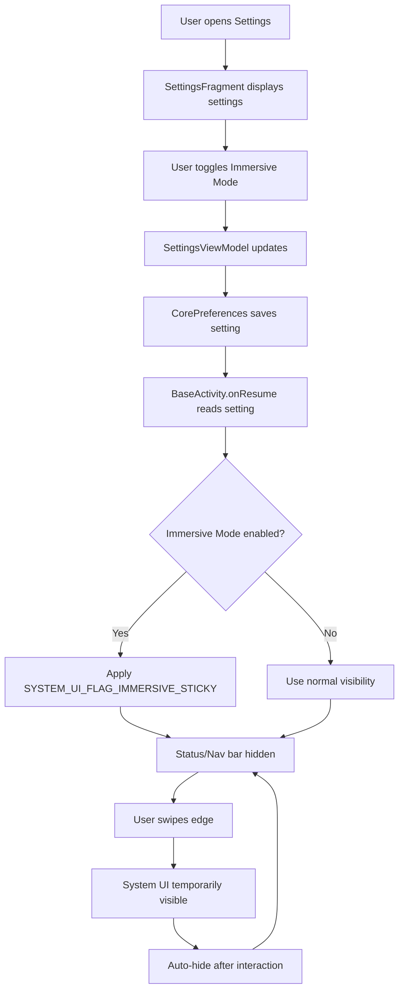

# Immersive Mode Feature Plan

## Overview
This document outlines the implementation plan for adding an immersive mode toggle to the Linhome Android application. Immersive mode hides the status bar and navigation bar while allowing users to access system UI by swiping from the screen edges.

## Feature Description
- **Immersive Mode**: A settings toggle that enables immersive fullscreen mode across all activities
- When enabled, the status bar and navigation bar are hidden
- Users can swipe from screen edges to temporarily reveal system UI
- System UI automatically hides again after interaction

## Architecture Flow

## Implementation Steps

### 1. Add String Resources
**File**: `app/src/main/res/values/strings.xml`
- Add string for "Immersive mode" title
- Add string for "Immersive mode" summary/description

### 2. Add CorePreferences Property
**File**: `app/src/main/java/org/linhome/linphonecore/CorePreferences.kt`
- Add `immersiveMode` property with getter/setter
- Store in config under "app" section with key "immersive_mode"

### 3. Add SettingsViewModel Property
**File**: `app/src/main/java/org/linhome/ui/settings/SettingsViewModel.kt`
- Add `immersiveMode` MutableLiveData
- Add `immersiveModeListener` SettingListenerStub
- Initialize with value from CorePreferences

### 4. Add UI Toggle to Settings
**File**: `app/src/main/res/layout/fragment_settings.xml`
- Add settings_widget_switch include for immersive mode
- Position after "Keep screen on" setting

### 5. Implement Immersive Mode in BaseActivity
**File**: `app/src/main/java/org/linbase/BaseActivity.kt`
- Override `onResume()` to apply immersive mode
- Use `View.SYSTEM_UI_FLAG_IMMERSIVE_STICKY` flag
- Hide status bar and navigation bar when enabled

### 6. Update MainActivity
**File**: `app/src/main/java/org/linhome/MainActivity.kt`
- Remove hardcoded fullscreen flags in `onCreate()`
- Let BaseActivity handle fullscreen logic based on setting

## Technical Details

### Immersive Mode Flags
- `View.SYSTEM_UI_FLAG_IMMERSIVE_STICKY`: Hides system UI but allows swipe to reveal
- `View.SYSTEM_UI_FLAG_LOW_PROFILE`: Hides status bar
- `View.SYSTEM_UI_FLAG_HIDE_NAVIGATION`: Hides navigation bar
- `View.SYSTEM_UI_FLAG_FULLSCREEN`: Hides status bar

### Android API Compatibility
- Immersive mode requires API 14+
- Sticky mode (swipe to reveal) requires API 19+
- App targets API 34, so all features are supported

## Files to Modify

| File | Changes |
|------|---------|
| `app/src/main/res/values/strings.xml` | Add 2 new string resources |
| `app/src/main/java/org/linhome/linphonecore/CorePreferences.kt` | Add immersiveMode property |
| `app/src/main/java/org/linhome/ui/settings/SettingsViewModel.kt` | Add immersiveMode LiveData and listener |
| `app/src/main/res/layout/fragment_settings.xml` | Add toggle UI element |
| `app/src/main/java/org/linhome/BaseActivity.kt` | Implement immersive mode logic |
| `app/src/main/java/org/linhome/MainActivity.kt` | Remove hardcoded fullscreen flags |

## Testing Checklist
- [ ] Toggle appears in Settings
- [ ] Toggle state persists after app restart
- [ ] Immersive mode activates when enabled
- [ ] System UI can be revealed by swiping
- [ ] System UI auto-hides after interaction
- [ ] Normal mode works when toggle is disabled
- [ ] All activities respect the setting

## Notes
- The immersive mode setting will be stored in the Linphone core configuration
- The setting applies globally to all activities extending BaseActivity
- No additional permissions are required for immersive mode
