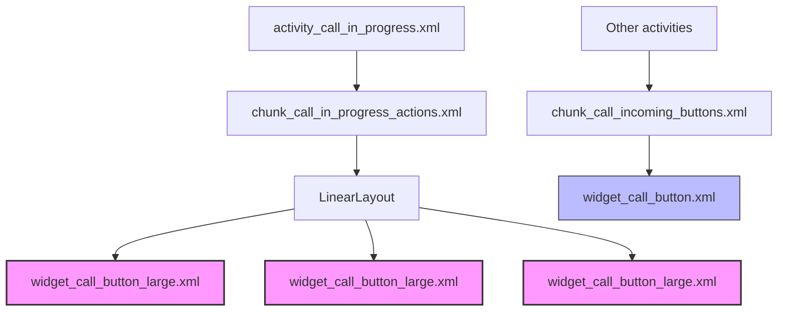

# Increase Call In Progress Action Size - Revised Plan

## Objective
Increase the size of the call-in-progress action (found in `chunk_call_in_progress_actions.xml`) to 2x wider/taller.

## Analysis

### Files Involved
- **[`chunk_call_in_progress_actions.xml`](app/src/main/res/layout/chunk_call_in_progress_actions.xml)**: The main container for call-in-progress actions
- **[`widget_call_button.xml`](app/src/main/res/layout/widget_call_button.xml)**: The existing button widget (NOT to be modified as it's used in many other places)
- **[`widget_call_button_large.xml`](app/src/main/res/layout/widget_call_button_large.xml)**: New larger version of the button widget (to be created)
- **[`activity_call_in_progress.xml`](app/src/main/res/layout/activity_call_in_progress.xml)**: The activity that uses the action chunk

### Current State
The `chunk_call_in_progress_actions.xml` uses `widget_call_button.xml` which has fixed dimensions (120dp × 80dp). Scaling alone was tried but causes the buttons to render off-screen.

### Solution Approach
Create a separate larger version of the button widget (`widget_call_button_large.xml`) with 2x dimensions, and update `chunk_call_in_progress_actions.xml` to use this new widget instead.

## Changes Required

### 1. Create `widget_call_button_large.xml`
New file with 2x dimensions:
- LinearLayout: 240dp width × 160dp height (was 120dp × 80dp)
- Border/ImageView: 120dp × 120dp (was 60dp × 60dp)
- Icon padding: 24dp (was 12dp)
- Inner layout padding: 8dp (was 4dp)

### 2. Update `chunk_call_in_progress_actions.xml`
- Replace all `<include layout="@layout/widget_call_button">` with `<include layout="@layout/widget_call_button_large">`
- Remove `android:scaleX="1"` and `android:scaleY="1"` from the LinearLayout

## Implementation Steps

| # | Task | Status |
|---|------|--------|
| 1 | Create widget_call_button_large.xml (2x dimensions: 240dp × 160dp) | Pending |
| 2 | Update chunk_call_in_progress_actions.xml to use widget_call_button_large.xml | Pending |
| 3 | Remove scale properties from chunk_call_in_progress_actions.xml | Pending |
| 4 | Verify changes are complete | Pending |

## Mermaid Diagram - Component Relationship

## Notes
- The original `widget_call_button.xml` remains unchanged to avoid affecting other components
- The new `widget_call_button_large.xml` is a copy with doubled dimensions
- This approach ensures the call-in-progress actions are properly sized without rendering off-screen
