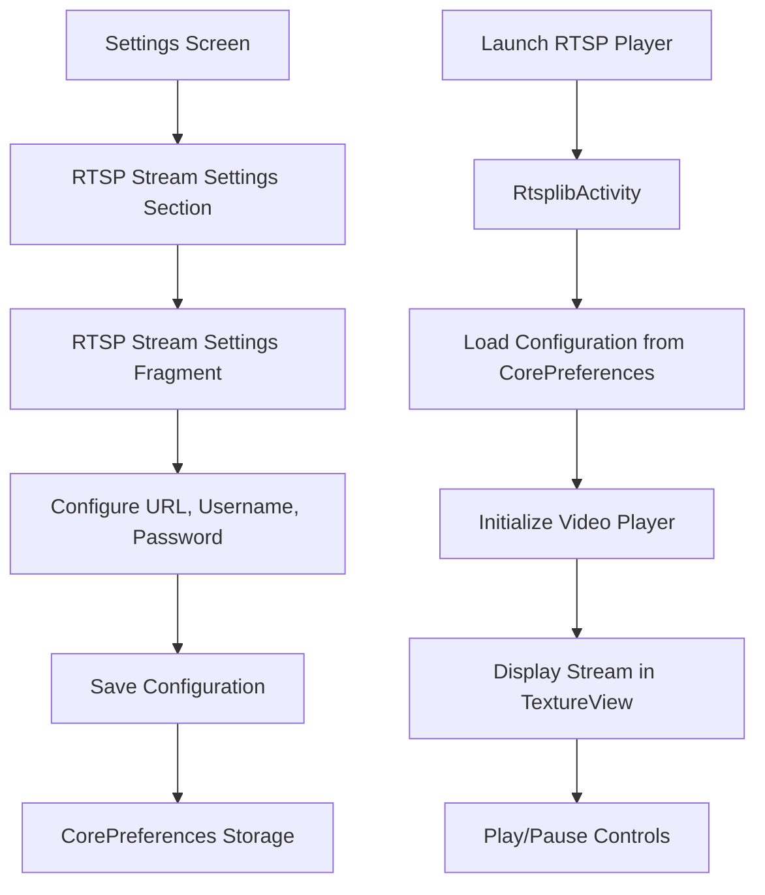

# RTSP Stream Viewer Feature

## Overview
This document outlines the implementation plan for adding an RTSP stream viewer activity to the Linhome Android application. The feature allows users to configure and view a single RTSP video stream (H.264 codec) with URL, username, and password authentication.

## Requirements
- Display RTSP video stream with H.264 codec support
- Configure stream via URL, username, and password
- Settings screen for stream configuration
- Single stream configuration (not multiple streams)
- Full-screen video playback with controls

## Architecture

### Component Structure

```
RTSP Stream Feature
├── Data Layer
│   ├── RTSPStream.kt - Data class for stream configuration
│   └── CorePreferences.kt - RTSP stream storage (existing file, extended)
│
├── UI Layer - Settings
│   ├── RTSPStreamViewModel.kt - Manages stream configuration state
│   ├── RTSPStreamSettingsFragment.kt - Settings UI fragment
│   └── fragment_rtsp_stream_settings.xml - Settings layout
│
├── UI Layer - Player
│   ├── RtsplibActivity.kt - Main activity for RTSP playback
│   ├── RtsplibViewModel.kt - Player state management
│   └── activity_rtsplib.xml - Player layout
│
└── Infrastructure
    ├── AndroidManifest.xml - Activity registration
    └── strings.xml - String resources
```

## Component Details

### 1. RTSPStream Data Class
**Location:** `app/src/main/java/org/linhome/entities/RTSPStream.kt`

```kotlin
data class RTSPStream(
    val url: String,
    val username: String,
    val password: String
)
```

### 2. CorePreferences Extension
**Location:** `app/src/main/java/org/linhome/linphonecore/CorePreferences.kt`

Add RTSP stream configuration storage:
- `rtspStreamUrl: String` - Stream URL
- `rtspStreamUsername: String` - Authentication username
- `rtspStreamPassword: String` - Authentication password

### 3. RTSPStreamViewModel
**Location:** `app/src/main/java/org/linhome/ui/settings/RTSPStreamViewModel.kt`

Responsibilities:
- Manage stream configuration state
- Validate URL format
- Handle save/cancel operations
- Provide LiveData for UI binding

### 4. RTSPStreamSettingsFragment
**Location:** `app/src/main/java/org/linhome/ui/settings/RTSPStreamSettingsFragment.kt`

UI Components:
- EditText for RTSP URL (with hint: "rtsp://example.com/stream")
- EditText for username
- EditText for password (password type)
- Save and Cancel buttons
- Validation feedback

**Layout:** `app/src/main/res/layout/fragment_rtsp_stream_settings.xml`

### 5. RtsplibActivity
**Location:** `app/src/main/java/org/linhome/ui/player/RtsplibActivity.kt`

Responsibilities:
- Load RTSP stream configuration from CorePreferences
- Initialize video player (using Linphone SDK Player or ExoPlayer)
- Display video in TextureView
- Handle play/pause controls
- Manage lifecycle (onPause, onDestroy)

**Layout:** `app/src/main/res/layout/activity_rtsplib.xml`

### 6. RtsplibViewModel
**Location:** `app/src/main/java/org/linhome/ui/player/RtsplibViewModel.kt`

Responsibilities:
- Player state management (playing, paused, error)
- Video position tracking
- Error handling and reporting

## Implementation Steps

### Phase 1: Data Layer
1. Create RTSPStream data class
2. Add RTSP preferences to CorePreferences.kt

### Phase 2: Settings UI
3. Add string resources for RTSP settings
4. Create RTSPStreamViewModel
5. Create RTSPStreamSettingsFragment and layout
6. Add RTSP settings section to fragment_settings.xml
7. Update SettingsViewModel if needed

### Phase 3: Player Activity
8. Create RtsplibActivity
9. Create RtsplibViewModel
10. Create activity_rtsplib.xml layout
11. Register activity in AndroidManifest.xml

### Phase 4: Integration
12. Add INTERNET permission if not present
13. Test RTSP stream playback
14. Verify settings persistence

## UI Flow



## Technical Considerations

### Video Player Implementation
The implementation can use either:
1. **Linphone SDK Player** - Already used in PlayerActivity, supports H.264
2. **ExoPlayer** - More flexible, better RTSP support

**Recommendation:** Use Linphone SDK Player for consistency with existing codebase, but verify RTSP support.

### RTSP URL Format
Expected format: `rtsp://[username:password@]host:port/path`
- Username and password can be embedded in URL or provided separately
- Separate fields allow for easier password management

### Permissions Required
- `android.permission.INTERNET` - For network access (check if already present)
- `android.permission.FOREGROUND_SERVICE_CAMERA` - For background video playback (if needed)

### Error Handling
- Invalid URL format
- Connection timeout
- Authentication failure
- Unsupported codec
- Network connectivity issues

## Testing Checklist
- [ ] Settings screen displays correctly
- [ ] URL validation works
- [ ] Configuration saves to CorePreferences
- [ ] Configuration loads on activity start
- [ ] Video stream plays correctly
- [ ] H.264 codec is supported
- [ ] Username/password authentication works
- [ ] Play/pause controls function
- [ ] Activity lifecycle handled properly
- [ ] Error messages display correctly

## Future Enhancements
- Support for multiple RTSP streams
- Stream presets/quick access
- Picture-in-picture mode
- Recording capability
- Stream quality adjustment
- Network quality indicator
