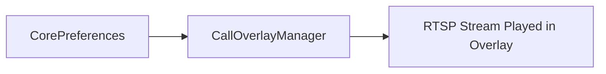
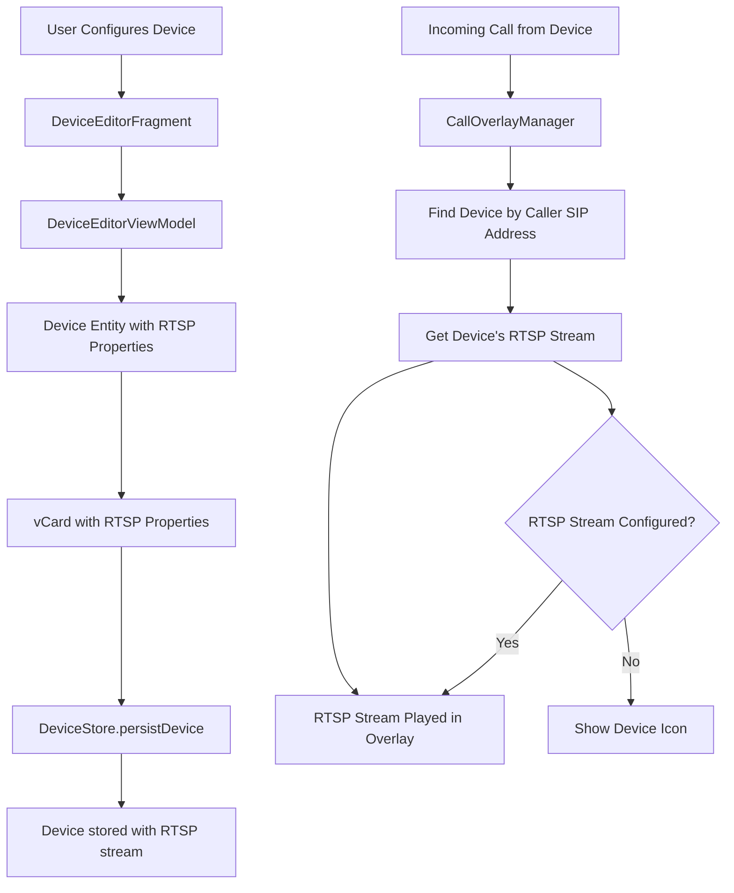
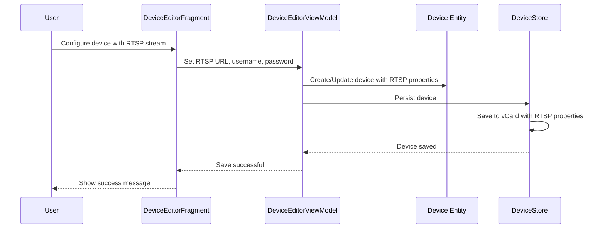
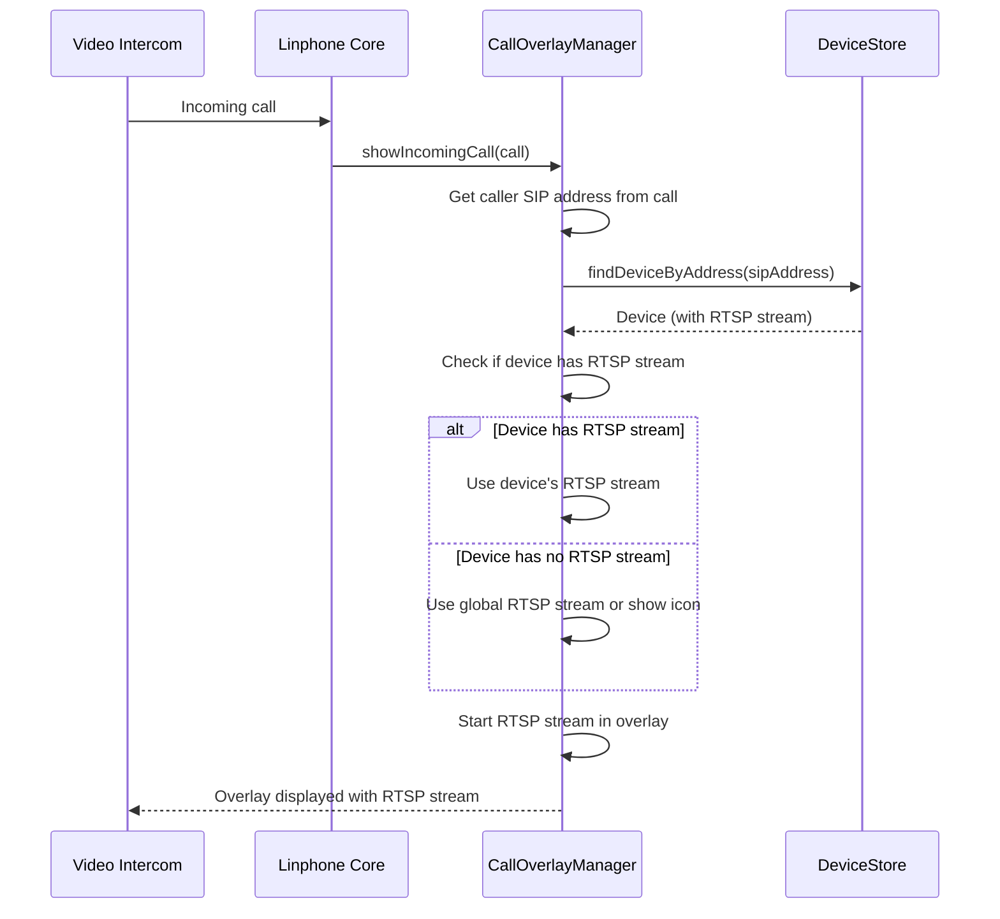

# RTSP Stream Configuration via vCard - Implementation Plan (Updated)

## Overview

This document outlines the implementation plan to add RTSP stream configuration to devices using vCard. When a device calls you (incoming call), the call overlay will show that specific device's RTSP stream, which is configured in the device's vCard.

## Use Case

1. User configures a device (e.g., video intercom) with an RTSP stream URL in the device editor
2. The RTSP stream configuration is saved to the device's vCard
3. When that device calls you (incoming call), the call overlay displays the device's RTSP stream
4. If the device doesn't have an RTSP stream configured, the overlay falls back to showing the device icon

## Current Architecture

### Device vCard Structure
Devices currently use the following vCard extended properties:
- `X-LINPHONE-ACCOUNT-TYPE` - Device type (e.g., video intercom)
- `X-LINPHONE-ACCOUNT-DTMF-PROTOCOL` - DTMF sending method
- `X-LINPHONE-ACCOUNT-ACTION` - List of actions (type~code)

### Current RTSP Stream Flow


The current implementation uses a global RTSP stream configuration from CorePreferences for all call overlays.

### New RTSP Stream Flow


## Implementation Details

### 1. Device Entity Changes

#### Add RTSP Stream Properties
```kotlin
@Parcelize
data class Device(
    var id: String,
    var type: String?,
    var name: String,
    var address: String,
    var actionsMethodType: String?,
    var actions: ArrayList<Action>?,
    var isRemotelyProvisionned: Boolean,
    // New RTSP stream properties
    var rtspStreamUrl: String = "",
    var rtspStreamUsername: String = "",
    var rtspStreamPassword: String = ""
) : Parcelable
```

#### Add vCard Header Constants
```kotlin
companion object {
    const val vcard_device_type_header = "X-LINPHONE-ACCOUNT-TYPE"
    const val vcard_actions_list_header = "X-LINPHONE-ACCOUNT-ACTION"
    const val vcard_action_method_type_header = "X-LINPHONE-ACCOUNT-DTMF-PROTOCOL"
    // New RTSP stream headers
    const val vcard_rtsp_url_header = "X-LINPHONE-RTSP-URL"
    const val vcard_rtsp_username_header = "X-LINPHONE-RTSP-USERNAME"
    const val vcard_rtsp_password_header = "X-LINPHONE-RTSP-PASSWORD"
    ...
}
```

#### Update Device Constructor (from vCard)
```kotlin
constructor(card: Vcard, isRemotelyProvisionned: Boolean) : this(
    card.sipAddresses.component1()?.asStringUriOnly()!!.md5(),
    card.getExtendedPropertiesValuesByName(vcard_device_type_header).component1(),
    card.fullName!!,
    card.sipAddresses.component1()?.asStringUriOnly()!!,
    vCardActionMethodsToDeviceMethods.get(
        card.getExtendedPropertiesValuesByName(vcard_action_method_type_header).component1()
    ),
    ArrayList(),
    isRemotelyProvisionned
) {
    // Parse RTSP stream properties from vCard
    rtspStreamUrl = card.getExtendedPropertiesValuesByName(vcard_rtsp_url_header).component1() ?: ""
    rtspStreamUsername = card.getExtendedPropertiesValuesByName(vcard_rtsp_username_header).component1() ?: ""
    rtspStreamPassword = card.getExtendedPropertiesValuesByName(vcard_rtsp_password_header).component1() ?: ""
    
    // Parse actions
    card.getExtendedPropertiesValuesByName(vcard_actions_list_header).forEach { action ->
        var actionCleaned = action.replace("\\;", "~").replace(";", "~")
        var components = actionCleaned.split("~")
        if (components.size != 2) {
            Log.e("Unable to create action from VCard $action")
        } else {
            actions?.add(Action(components.component1(), components.component2()))
        }
    }
}
```

#### Update Friend Property (to vCard)
```kotlin
val friend: Friend
    get() =
        LinhomeApplication.coreContext.core.createFriend().let { friend ->
            friend.createVcard(name)
            friend.vcard?.addExtendedProperty(vcard_device_type_header, type!!)
            friend.vcard?.addSipAddress(address)
            friend.vcard?.addExtendedProperty(vcard_action_method_type_header,
                deviceActionMethodsTovCardActionMethods().get(actionsMethodType!!)!!)
            actions?.forEach { it ->
                friend.vcard?.addExtendedProperty(vcard_actions_list_header, it.type!! + "~" + it.code!!)
            }
            // Add RTSP stream properties to vCard
            if (rtspStreamUrl.isNotEmpty()) {
                friend.vcard?.addExtendedProperty(vcard_rtsp_url_header, rtspStreamUrl)
            }
            if (rtspStreamUsername.isNotEmpty()) {
                friend.vcard?.addExtendedProperty(vcard_rtsp_username_header, rtspStreamUsername)
            }
            if (rtspStreamPassword.isNotEmpty()) {
                friend.vcard?.addExtendedProperty(vcard_rtsp_password_header, rtspStreamPassword)
            }
            Log.i("[Device] created vCard for device: $name ${friend.vcard?.asVcard4String()}")
            friend
        }
```

### 2. DeviceEditorViewModel Changes

#### Add RTSP Stream Fields
```kotlin
class DeviceEditorViewModel : ViewModelWithTools() {
    // Existing fields...
    
    // New RTSP stream fields
    var rtspUrl: Pair<MutableLiveData<String>, MutableLiveData<Boolean>> =
        Pair(MutableLiveData<String>(), MutableLiveData<Boolean>(false))
    var rtspUsername: Pair<MutableLiveData<String>, MutableLiveData<Boolean>> =
        Pair(MutableLiveData<String>(), MutableLiveData<Boolean>(false))
    var rtspPassword: Pair<MutableLiveData<String>, MutableLiveData<Boolean>> =
        Pair(MutableLiveData<String>(), MutableLiveData<Boolean>(false))
    
    // Existing device property
    var device: Device? = null
        set(value) {
            field = value
            value?.also {
                name.first.value = it.name
                address.first.value = it.address
                deviceType.value = indexByBackingKey(it.type, availableDeviceTypes)
                actionsMethod.value = indexByBackingKey(it.actionsMethodType, availableMethodTypes)
                // Load RTSP stream properties
                rtspUrl.first.value = it.rtspStreamUrl
                rtspUsername.first.value = it.rtspStreamUsername
                rtspPassword.first.value = it.rtspStreamPassword
            }
        }
    
    // Validation for RTSP URL
    fun validateRtspUrl(): Boolean {
        val url = rtspUrl.first.value?.trim() ?: ""
        if (url.isNotEmpty() && !url.startsWith("rtsp://", ignoreCase = true)) {
            rtspUrl.second.value = false
            return false
        }
        rtspUrl.second.value = true
        return true
    }
    
    // Update saveDevice to save RTSP configuration
    fun saveDevice(): Boolean {
        if (!valid()) return false
        actionsViewModels.forEach {
            if (!it.valid()) return false
        }
        if (!validateRtspUrl()) return false
        
        if (device == null) {
            device = Device(
                if (deviceType.value == 0) null else availableDeviceTypes.get(deviceType.value!!).backingKey,
                name.first.value!!,
                if (address.first.value!!.startsWith("sip:") || address.first.value!!.startsWith("sips:")) 
                    address.first.value!! 
                else "sip:${address.first.value}",
                if (actionsMethod.value == 0) null else availableMethodTypes.get(actionsMethod.value!!).backingKey,
                ArrayList(),
                false,
                // Save RTSP stream properties
                rtspUrl.first.value ?: "",
                rtspUsername.first.value ?: "",
                rtspPassword.first.value ?: ""
            )
            actionsViewModels.forEach {
                if (it.notEmpty())
                    device?.actions?.add(
                        Action(
                            availableActionTypes.get(it.type.value!!).backingKey,
                            it.code.first.value!!
                        )
                    )
            }
            DeviceStore.persistDevice(device!!)
        } else {
            device?.also {
                it.type = if (deviceType.value == 0) null else availableDeviceTypes.get(deviceType.value!!).backingKey
                it.name = name.first.value!!
                it.address = if (address.first.value!!.startsWith("sip:") || address.first.value!!.startsWith("sips:")) 
                    address.first.value!! 
                else "sip:${address.first.value}"
                it.actionsMethodType = if (actionsMethod.value == 0) null else availableMethodTypes.get(actionsMethod.value!!).backingKey
                it.actions = ArrayList()
                // Update RTSP stream properties
                it.rtspStreamUrl = rtspUrl.first.value ?: ""
                it.rtspStreamUsername = rtspUsername.first.value ?: ""
                it.rtspStreamPassword = rtspPassword.first.value ?: ""
                
                actionsViewModels.forEach { action ->
                    if (action.notEmpty())
                        it.actions?.add(
                            Action(
                                availableActionTypes.get(action.type.value!!).backingKey,
                                action.code.first.value!!
                            )
                        )
                }
            }
            DeviceStore.saveLocalDevices()
        }
        
        return true
    }
}
```

### 3. DeviceEditorFragment Layout Changes

Add RTSP stream input fields to `fragment_device_edit.xml`:

```xml
<!-- RTSP Stream Configuration Section -->
<com.google.android.material.textfield.TextInputLayout
    android:id="@+id/rtspUrlInputLayout"
    android:layout_width="match_parent"
    android:layout_height="wrap_content"
    android:layout_marginTop="24dp"
    android:hint="@string/device_rtsp_url"
    app:boxBackgroundMode="outline">

    <com.google.android.material.textfield.TextInputEditText
        android:id="@+id/rtspUrlEditText"
        android:layout_width="match_parent"
        android:layout_height="wrap_content"
        android:inputType="textUri"
        android:hint="@string/device_rtsp_url_hint"
        android:text="@{model.rtspUrl.first}"
        android:onTextChanged="{(text, start, before, count) -> model.rtspUrl.first.value = text.toString()}"
        android:imeOptions="actionNext"/>
</com.google.android.material.textfield.TextInputLayout>

<com.google.android.material.textfield.TextInputLayout
    android:id="@+id/rtspUsernameInputLayout"
    android:layout_width="match_parent"
    android:layout_height="wrap_content"
    android:layout_marginTop="16dp"
    android:hint="@string/device_rtsp_username"
    app:boxBackgroundMode="outline">

    <com.google.android.material.textfield.TextInputEditText
        android:id="@+id/rtspUsernameEditText"
        android:layout_width="match_parent"
        android:layout_height="wrap_content"
        android:inputType="text"
        android:text="@{model.rtspUsername.first}"
        android:onTextChanged="{(text, start, before, count) -> model.rtspUsername.first.value = text.toString()}"
        android:imeOptions="actionNext"/>
</com.google.android.material.textfield.TextInputLayout>

<com.google.android.material.textfield.TextInputLayout
    android:id="@+id/rtspPasswordInputLayout"
    android:layout_width="match_parent"
    android:layout_height="wrap_content"
    android:layout_marginTop="16dp"
    android:hint="@string/device_rtsp_password"
    app:boxBackgroundMode="outline"
    app:passwordToggleEnabled="true">

    <com.google.android.material.textfield.TextInputEditText
        android:id="@+id/rtspPasswordEditText"
        android:layout_width="match_parent"
        android:layout_height="wrap_content"
        android:inputType="textPassword"
        android:text="@{model.rtspPassword.first}"
        android:onTextChanged="{(text, start, before, count) -> model.rtspPassword.first.value = text.toString()}"/>
</com.google.android.material.textfield.TextInputLayout>

<TextView
    android:id="@+id/rtspHintText"
    android:layout_width="match_parent"
    android:layout_height="wrap_content"
    android:text="@string/device_rtsp_hint"
    android:textSize="12sp"
    android:textColor="@color/color_c"
    android:layout_marginTop="8dp"/>
```

### 4. DeviceStore Changes

Add a helper method to find device by SIP address:

```kotlin
object DeviceStore {
    // Existing code...
    
    /**
     * Finds a device by its SIP address.
     * @param address The SIP address string (e.g., "sip:device@example.com")
     * @return The device if found, null otherwise
     */
    fun findDeviceByAddress(address: String?): Device? {
        return address?.let { addressString ->
            LinhomeApplication.coreContext.core.createAddress(addressString)
                ?.let { addressAddress ->
                    return findDeviceByAddress(addressAddress)
                }
        }
    }
    
    /**
     * Finds a device by its SIP address (Address object).
     * @param address The SIP address object
     * @return The device if found, null otherwise
     */
    fun findDeviceByAddress(address: Address): Device? {
        return devices.find { device ->
            val deviceAddress = LinhomeApplication.coreContext.core.createAddress(device.address)
            deviceAddress?.username == address.username && deviceAddress?.domain == address.domain
        }
    }
}
```

### 5. CallOverlayManager Changes

Update the CallOverlayManager to use device-specific RTSP stream:

```kotlin
class CallOverlayManager(private val context: Context) {
    // Existing code...
    
    fun showIncomingCall(call: Call) {
        if (!corePreferences.showIncomingCallOverlay) {
            return
        }
        
        if (!hasSystemAlertWindowPermission(context)) {
            return
        }
        
        if (call.state != Call.State.IncomingReceived && call.state != Call.State.IncomingEarlyMedia) {
            return
        }
        
        currentCall = call
        
        windowManager = context.getSystemService(Context.WINDOW_SERVICE) as WindowManager
        
        val params = createOverlayParams()
        
        // Use the new XML layout for the overlay
        val overlay = LayoutInflater.from(context).inflate(R.layout.activity_call_overlay, null)
        
        // Set caller name
        val callerName = overlay.findViewById<TextView>(R.id.callerName)
        callerName.text = call.remoteAddress.asString()
        
        // Find the device associated with this call
        val device = DeviceStore.findDeviceByAddress(call.remoteAddress.asString())
        
        // Check if RTSP stream overlay is enabled
        val useRTSPOverlay = corePreferences.showIncomingCallOverlayWithRTSP
        val rtspVideoView = overlay.findViewById<TextureView>(R.id.rtspVideoView)
        val deviceIcon = overlay.findViewById<TextView>(R.id.deviceIcon)
        
        if (useRTSPOverlay) {
            // Show RTSP video view and hide device icon
            rtspVideoView.visibility = View.VISIBLE
            deviceIcon.visibility = View.GONE
        } else {
            // Hide RTSP video view, show device icon (default behavior)
            rtspVideoView.visibility = View.GONE
            deviceIcon.visibility = View.VISIBLE
        }
        
        // Set up decline button
        val declineButton = overlay.findViewById<TextView>(R.id.declineButton)
        declineButton.setOnClickListener {
            try {
                call.decline(Reason.Declined)
                hideIncomingCall()
            } catch (e: Exception) {
                e.printStackTrace()
            }
        }
        
        // Set up answer button
        val answerButton = overlay.findViewById<TextView>(R.id.answerButton)
        answerButton.setOnClickListener {
            try {
                call.extendedAccept()
                hideIncomingCall()
            } catch (e: Exception) {
                e.printStackTrace()
            }
        }
        
        try {
            windowManager?.addView(overlay, params)
            callOverlay = overlay
            
            // Setup RTSP stream playback AFTER the overlay is added to the window
            // This ensures the TextureView surface is available
            if (useRTSPOverlay) {
                setupRTSPStream(rtspVideoView, device)
                
                // Force layout to ensure TextureView is measured and laid out
                rtspVideoView.post {
                    // Small delay to ensure surface is available
                    android.os.Handler(android.os.Looper.getMainLooper()).postDelayed({
                        if (rtspVideoView.isAvailable) {
                            android.util.Log.i("CallOverlayManager", "TextureView is available after post")
                        } else {
                            android.util.Log.w("CallOverlayManager", "TextureView is NOT available after post")
                        }
                    }, 100)
                }
            }
        } catch (e: Exception) {
            // If overlay creation fails, fall back to notification
            e.printStackTrace()
        }
    }
    
    /**
     * Sets up the RTSP stream playback for the given TextureView using VLC.
     * Uses the device's RTSP stream if available, otherwise falls back to global configuration.
     */
    private fun setupRTSPStream(textureView: TextureView, device: Device?) {
        val corePreferences = LinhomeApplication.corePreferences
        
        // Try to get RTSP stream from device first
        val rtspStream = device?.let { dev ->
            if (dev.rtspStreamUrl.isNotEmpty()) {
                org.linhome.entities.RTSPStream(
                    url = dev.rtspStreamUrl,
                    username = dev.rtspStreamUsername,
                    password = dev.rtspStreamPassword
                )
            } else {
                null
            }
        } ?: corePreferences.getRtspStreamConfiguration()
        
        if (rtspStream.url.isEmpty()) {
            android.util.Log.e("CallOverlayManager", "No RTSP stream URL configured for device or globally")
            // Fall back to showing device icon
            callOverlay?.findViewById<TextureView>(R.id.rtspVideoView)?.visibility = View.GONE
            callOverlay?.findViewById<TextView>(R.id.deviceIcon)?.visibility = View.VISIBLE
            return
        }
        
        val streamUrl = rtspStream.buildAuthenticatedUrl()
        android.util.Log.i("CallOverlayManager", "Starting RTSP stream: $streamUrl (from ${if (device != null) "device" else "global config"})")
        
        try {
            // Create VLC player
            rtspVlcPlayer = RtspVlcPlayer(context)
            
            // Setup the video view with TextureView
            rtspVlcPlayer?.setupView(textureView)
            
            // Load and play the stream
            rtspVlcPlayer?.loadStream(streamUrl)
            
            android.util.Log.i("CallOverlayManager", "RTSP stream started successfully with VLC")
        } catch (e: Exception) {
            android.util.Log.e("CallOverlayManager", "Error starting RTSP stream: ${e.message}")
            e.printStackTrace()
        }
    }
    
    // Existing code...
}
```

### 6. VcardExtensions.kt Changes

Add validation for RTSP stream properties:

```kotlin
fun Vcard.isValid(): Boolean {
    val card = this
    
    // Existing device validation...
    
    // Optional: Validate RTSP stream properties if present
    val rtspUrl = card.getExtendedPropertiesValuesByName(Device.vcard_rtsp_url_header).component1()
    if (rtspUrl.isNotEmpty() && !rtspUrl.startsWith("rtsp://", ignoreCase = true)) {
        Log.e("[Device] vCard validation: invalid RTSP URL $rtspUrl")
        return false
    }
    
    return validActions
}
```

### 7. Strings Changes

Add new strings to `strings.xml`:

```xml
<!-- Device RTSP Stream Configuration -->
<string name="device_rtsp_stream">RTSP Stream</string>
<string name="device_rtsp_url">Stream URL</string>
<string name="device_rtsp_url_hint">rtsp://example.com/stream</string>
<string name="device_rtsp_username">Username (optional)</string>
<string name="device_rtsp_password">Password (optional)</string>
<string name="device_rtsp_hint">Configure RTSP stream for this device. When this device calls you, the RTSP stream will be shown in the call overlay.</string>
```

## Data Flow Diagram

### Device Configuration Flow


### Incoming Call Flow


## Testing Checklist

- [ ] Create a new device with RTSP stream configuration
- [ ] Verify RTSP stream properties are included in vCard
- [ ] Edit an existing device and update RTSP stream configuration
- [ ] Verify device can be found by SIP address in DeviceStore
- [ ] Simulate incoming call from a device with RTSP stream configured
- [ ] Verify the call overlay shows the device's RTSP stream
- [ ] Simulate incoming call from a device without RTSP stream configured
- [ ] Verify the call overlay falls back to device icon or global RTSP stream
- [ ] Test with anonymous RTSP stream (no username/password)
- [ ] Test with authenticated RTSP stream (with username/password)
- [ ] Test validation for invalid RTSP URL format

## Notes

1. The RTSP stream configuration is optional for devices. If no RTSP URL is provided, the device will work normally without RTSP overlay.

2. When an incoming call is received from a device, the CallOverlayManager will:
   - Find the device by the caller's SIP address
   - Check if the device has an RTSP stream configured
   - If yes, use the device's RTSP stream for the overlay
   - If no, fall back to the global RTSP stream configuration from CorePreferences
   - If neither is configured, show the device icon

3. The vCard validation should allow empty RTSP stream properties to maintain backward compatibility with existing devices.

4. Multiple devices can have different RTSP streams configured. Each device's RTSP stream will be used when that specific device calls.
