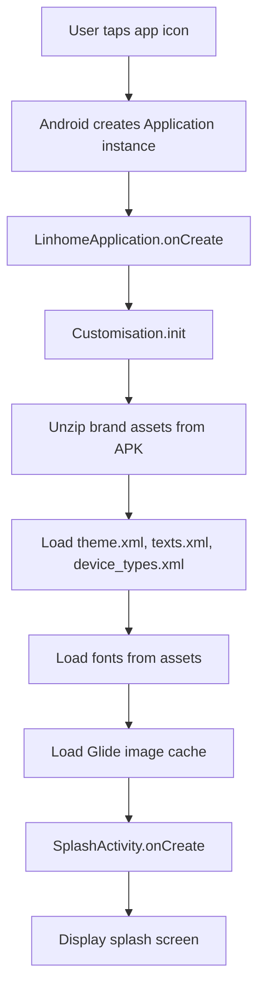
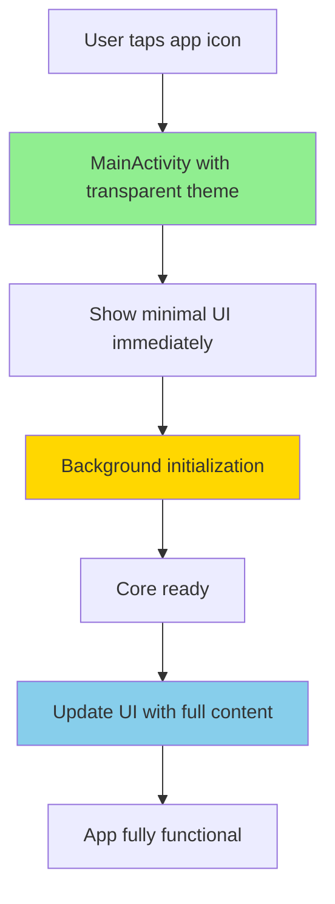

# Splash Screen Analysis: Why Startup Takes Time and How to Eliminate It

## Current Implementation

### Splash Activity Code
The current splash screen is implemented in [`SplashActivity.kt`](app/src/main/java/org/linhome/SplashActivity.kt:35):

```kotlin
class SplashActivity : GenericActivity() {
    override fun onCreate(savedInstanceState: Bundle?) {
        super.onCreate(savedInstanceState)
        // ... UI setup ...
        
        DataBindingUtil.setContentView(this, R.layout.activity_splash) as ActivitySplashBinding

        GlobalScope.launch(context = Dispatchers.Main) {
            delay(Theme.arbitraryValue("splash_display_duration_ms", "2000").toLong())
            val intent = Intent(this@SplashActivity, MainActivity::class.java)
            startActivity(intent)
            finish()
        }
    }
}
```

**Key Finding:** The splash screen has a hardcoded 2-second delay (`splash_display_duration_ms` = 2000ms).

---

## Why Startup Splash Screens Take Time

### 1. **Application Initialization Overhead**

When the app launches, the following must happen before the splash screen even appears:



### 2. **Linphone Core Initialization**

The [`LinhomeApplication`](app/src/main/java/org/linhome/LinhomeApplication.kt:37) class initializes critical components:

- **Factory configuration** - Creates Linphone core factory
- **Config loading** - Reads `linphone_rc` configuration files
- **CoreContext creation** - Initializes the SIP/VoIP core
- **DeviceStore setup** - Loads device database
- **Asset extraction** - Unzips brand assets (images, sounds, themes)

### 3. **Asset Loading and Processing**

From [`Theme.kt`](app/src/main/java/org/linhome/customisation/Theme.kt:52):

```kotlin
var glidesvg = GlideApp.with(LinhomeApplication.instance)
var glidegeneric = Glide.with(LinhomeApplication.instance)
```

- SVG parsing and conversion
- Image caching with Glide
- Typeface loading from assets

### 4. **Database Operations**

From [`LinhomeApplication.kt`](app/src/main/java/org/linhome/LinhomeApplication.kt:84):

```kotlin
coreContext.core.friendsDatabasePath = context.filesDir.absolutePath+"/devices.db"
```

- SQLite database initialization
- Friend list loading
- History events loading

### 5. **Network and Service Setup**

From [`CoreContext.kt`](app/src/main/java/org/linhome/linphonecore/CoreContext.kt:43):

- SIP account registration
- Network reachability checks
- Foreground service setup (if configured)

---

## Timeline Breakdown

```mermaid
gantt
    title App Startup Timeline
    dateFormat X
    axisFormat %s
    
    section Application Layer
    Application.onCreate          :0, 50
    Customisation.init            :50, 100
    Theme initialization          :150, 100
    
    section Linphone Core
    Factory setup                 :250, 100
    Config loading                :350, 50
    CoreContext creation          :400, 150
    
    section Data Layer
    Database init                 :550, 100
    DeviceStore setup             :650, 100
    
    section UI Layer
    SplashActivity onCreate       :750, 50
    Splash display (2000ms)       :800, 2000
    MainActivity launch           :2800, 0
```



**Total time before MainActivity:** ~2.8 seconds minimum (excluding splash delay)
**Total time with splash delay:** ~4.8 seconds

---

## Why the 2-Second Delay Exists

The splash screen delay was likely added to:

1. **Mask initialization time** - Give the app time to load assets and initialize the core
2. **Brand impression** - Show the logo for a memorable duration
3. **Perceived quality** - Rushing to the main screen might feel "broken"

However, this is a **band-aid solution** that makes startup feel slower.

---

## Strategies to Eliminate Splash Screens

### Strategy 1: **Launch MainActivity Directly**

**Approach:** Remove `SplashActivity` as the launcher and make `MainActivity` the entry point.

**Pros:**
- Immediate visual feedback
- No artificial delay
- Users see the app faster

**Cons:**
- MainActivity must handle initialization gracefully
- May show blank/white screen during setup

**Implementation:**
```xml
<!-- AndroidManifest.xml -->
<activity
    android:name="org.linhome.MainActivity"
    android:exported="true">
    <intent-filter>
        <action android:name="android.intent.action.MAIN" />
        <category android:name="android.intent.category.LAUNCHER" />
    </intent-filter>
</activity>
```

### Strategy 2: **Transparent Splash with Immediate UI**

**Approach:** Use a transparent theme for splash, show MainActivity content immediately.

**Pros:**
- No visible splash screen
- App feels instant
- Progressive loading of content

**Implementation:**
```xml
<!-- styles.xml -->
<style name="TransparentSplashTheme" parent="Theme.AppCompat.NoActionBar">
    <item name="android:windowBackground">@android:color/transparent</item>
    <item name="android:windowIsTranslucent">true</item>
</style>
```

### Strategy 3: **Async Initialization with Loading State**

**Approach:** Initialize core in background while showing minimal UI.

**Pros:**
- No blocking on main thread
- Progressive enhancement
- Better perceived performance

**Implementation:**
```kotlin
// MainActivity.kt
override fun onCreate(savedInstanceState: Bundle?) {
    super.onCreate(savedInstanceState)
    setContentView(R.layout.activity_main)
    
    // Initialize core in background
    GlobalScope.launch(Dispatchers.IO) {
        LinhomeApplication.ensureCoreExists(applicationContext)
        withContext(Dispatchers.Main) {
            // Update UI when ready
            showReadyState()
        }
    }
}
```

### Strategy 4: **Application-Level Pre-initialization**

**Approach:** Move critical initialization to Application.onCreate.

**Pros:**
- Initialization happens before any activity
- MainActivity is ready immediately
- Best perceived performance

**Implementation:**
```kotlin
// LinhomeApplication.kt
override fun onCreate() {
    super.onCreate()
    instance = this
    
    // Pre-initialize core immediately
    ensureCoreExists(this, force = true, startService = false)
}
```

### Strategy 5: **Android App Startup Library**

**Approach:** Use AndroidX Startup library for deterministic initialization.

**Pros:**
- Standard Android approach
- Works with WorkManager
- Handles process death gracefully

---

## Recommended Hybrid Approach



**Steps:**

1. **Remove SplashActivity** - Make MainActivity the launcher
2. **Use transparent/empty theme** - No visual splash
3. **Pre-initialize in Application** - Critical setup in `onCreate()`
4. **Show loading indicator** - If core not ready yet
5. **Progressive content loading** - Lazy load non-critical data

---

## Risks and Considerations

### 1. **Cold Start vs Warm Start**

- **Cold start** (app not running): Full initialization required
- **Warm start** (app in background): Can reuse existing core

### 2. **Process Death**

Android may kill the app process to reclaim memory. Need to handle:
- Core reinitialization
- State restoration
- Network reconnection

### 3. **Boot Receiver**

From [`BootReceiver.kt`](app/src/main/java/org/linhome/linphonecore/BootReceiver.kt:25):

```kotlin
// App may be started by boot receiver
// Core should already be running
```

If the app is auto-started at boot, the core may already be initialized.

### 4. **Memory Constraints**

Pre-initialization increases memory footprint. Consider:
- Lazy initialization for non-critical components
- Background service for core (already exists)

---

## Implementation Plan

### Phase 1: Remove Splash Delay
- Reduce `splash_display_duration_ms` to 0 or 500ms
- Test perceived performance

### Phase 2: Direct Launch
- Make MainActivity the launcher
- Remove SplashActivity or keep for deep links

### Phase 3: Pre-initialization
- Move core init to Application.onCreate
- Handle process death gracefully

### Phase 4: Progressive Loading
- Show skeleton screens
- Lazy load non-critical data

---

## Conclusion

The splash screen delay exists to mask initialization time, but it's a poor UX solution. By:

1. **Removing the splash screen entirely**
2. **Pre-initializing the core in Application**
3. **Using progressive loading patterns**

We can achieve **instant perceived startup** while maintaining functionality. The key is to show something immediately (even if minimal) and progressively enhance the UI as data becomes available.
